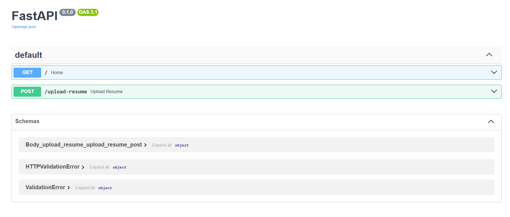
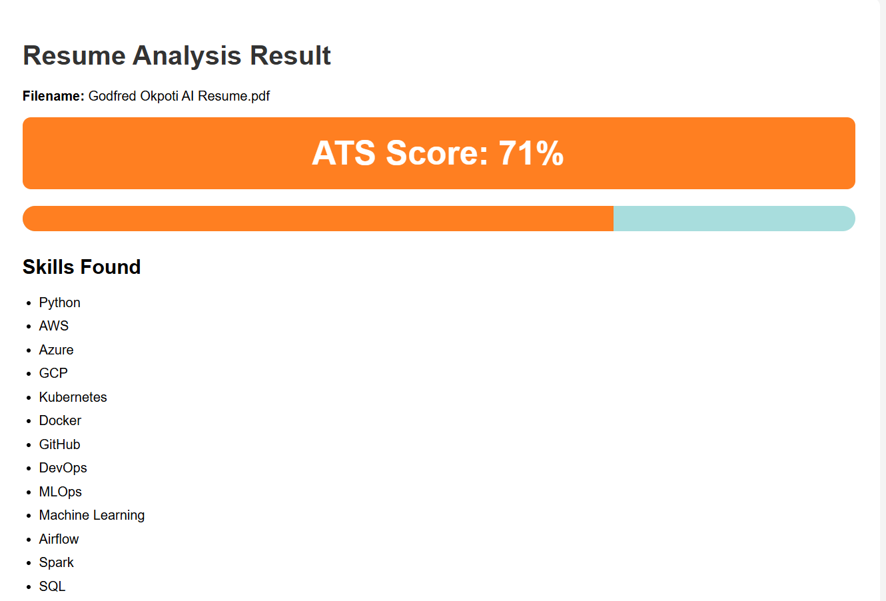
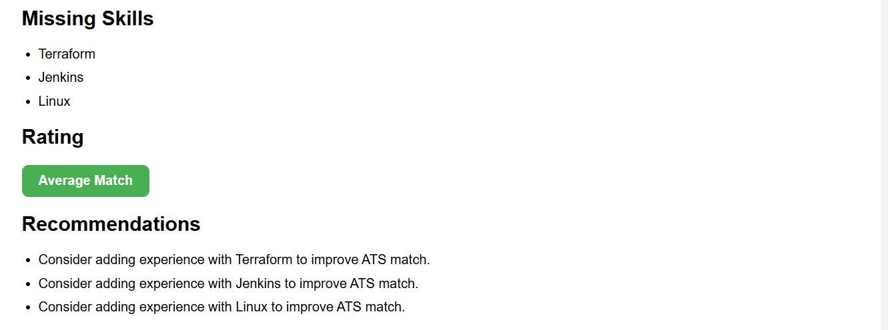

AI Resume Screening Platform

AI-powered ATS Resume Screening Platform built with FastAPI.

Features

Resume Upload
ATS Match Score
Skills Detection
Missing Skills Analysis
Resume Recommendations
FastAPI Backend
HTML Frontend

Technology Stack

Python
FastAPI
HTML/CSS
GitHub
Uvicorn

Project Architecture

User Uploads Resume

↓

FastAPI Application

↓

Resume Parser

↓

Skills Matching Engine

↓

ATS Scoring Engine

↓

Results Dashboard

Future Improvements

OpenAI Integration
PDF Resume Parsing
Job Description Matching
AI Recommendations
Dashboard Analytics

Author

Godfred Okpoti

Senior Cloud & DevOps Engineer | AI/ML Infrastructure Architect
## Architecture

```text
User Upload Resume
        │
        ▼
 FastAPI Backend
        │
        ▼
 Resume Parser
        │
        ▼
 ATS Scoring Engine
        │
        ▼
 Skills Detection
        │
        ▼
 Missing Skills Analysis
        │
        ▼
 Recommendation Engine
        │
        ▼
 Results Dashboard
```

## Application Screenshots

### FastAPI Swagger UI


### ATS Results Dashboard



### Missing Skills Analysis

